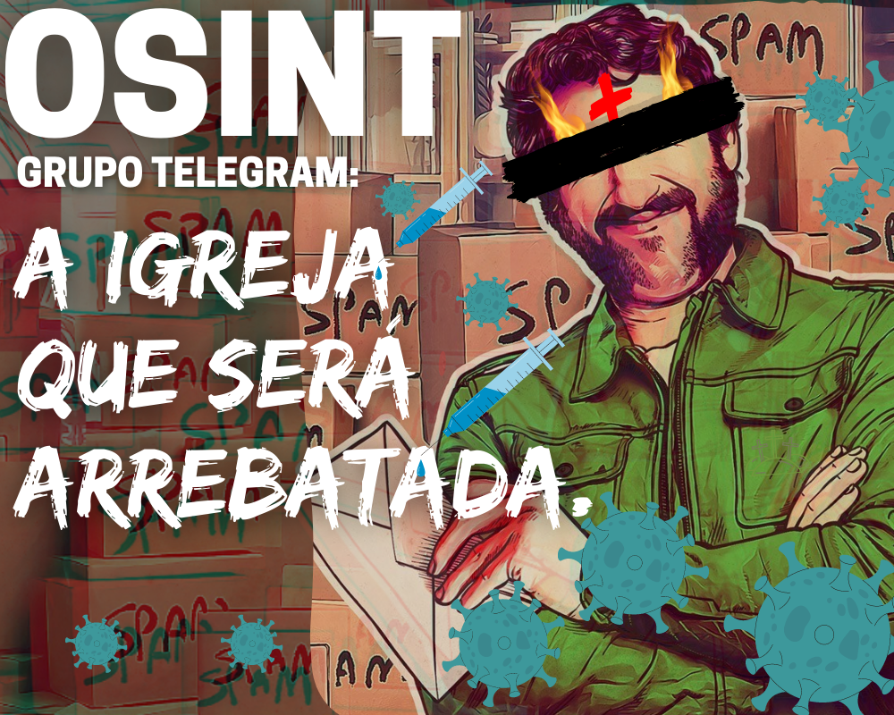
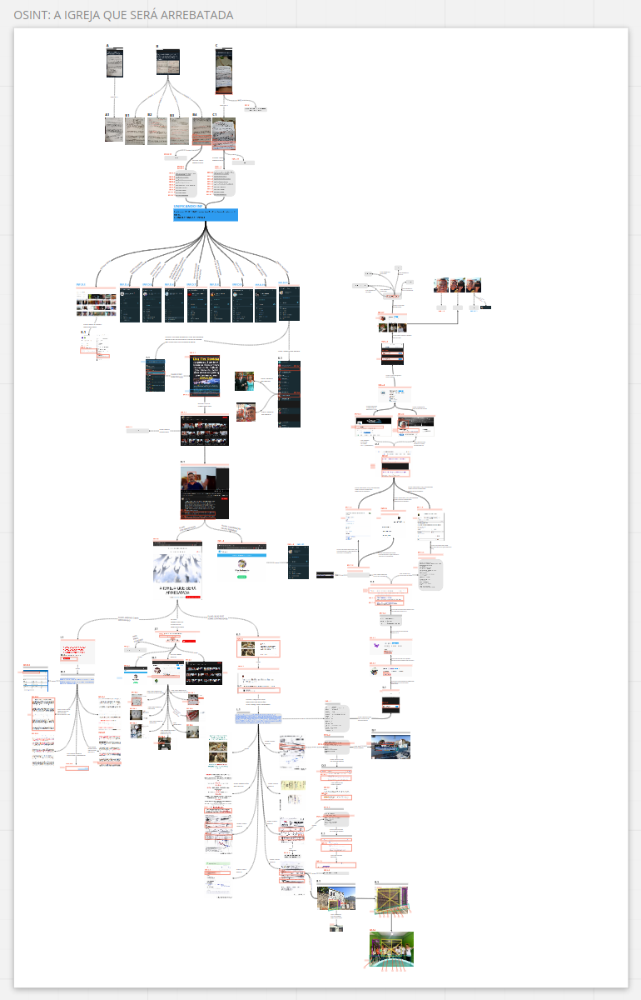

# OSINT: A Igreja que será arrebatada.
No dia 22 de junho de 1633, o astrônomo Galileu Galilei, considerado o criador do método 
científico, recebia sua sentença no tribunal da Inquisição. Pela acusação de defender o 
modelo de Copérnico, em que a Terra girava em torno do Sol, Galileu foi considerado um 
herético, forçado a repudiar as ideias heliocêntricas e sentenciado a prisão domiciliar, 
além de ter sua obra Diálogo incluída no Índice de Livros Proibidos do Vaticano. 

### CONTEXTO OSINT

Há algumas semanas dropou em minha timeline um post denunciando o recebimento de cartas 
negacionistas em sua residência. Diante disso, analisando o primeiro post que tive acesso,
fui em busca de outros relatos e identifiquei cerca de 3 reports e um padrão que aponta 
um comportamento de potencial grupo religioso envolvido em tal ato spammer.

### WARNING: 
```
Lembrando que os dados coletados são públicos e não foi necessário invasão de dispositivo 
eletrônico para tal Blog Post. Nenhum animal (Gado ou Jacaré ) foi ferido durante a criação 
de tal blog post.
```

### INFO: 
```
Neste blogpost é possível entender uma pequena organização para disseminação de fakenews via 
cartas, pois quando o individuo investe dinheiro e tempo para produzir tal propaganda, 
claramente existe intenção de externar suas ideias e agregar seguidores ou criar uma comunidade 
fechada que não confronte seu ideal de realidade. Para enumerar as evidências usarei um esquema 
de IDs para cada asset.
```



## BLOG POST
 - https://blog.mrcl0wn.com/osint-open-source-intelligence/osint-a-igreja-que-sera-arrebatada.html

 ## MIRO BOARD
 - https://miro.com/app/board/o9J_lmz1XKQ=/?moveToWidget=3074457367807208767&cot=14
 